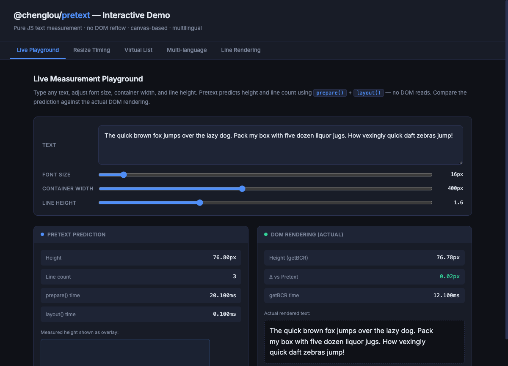
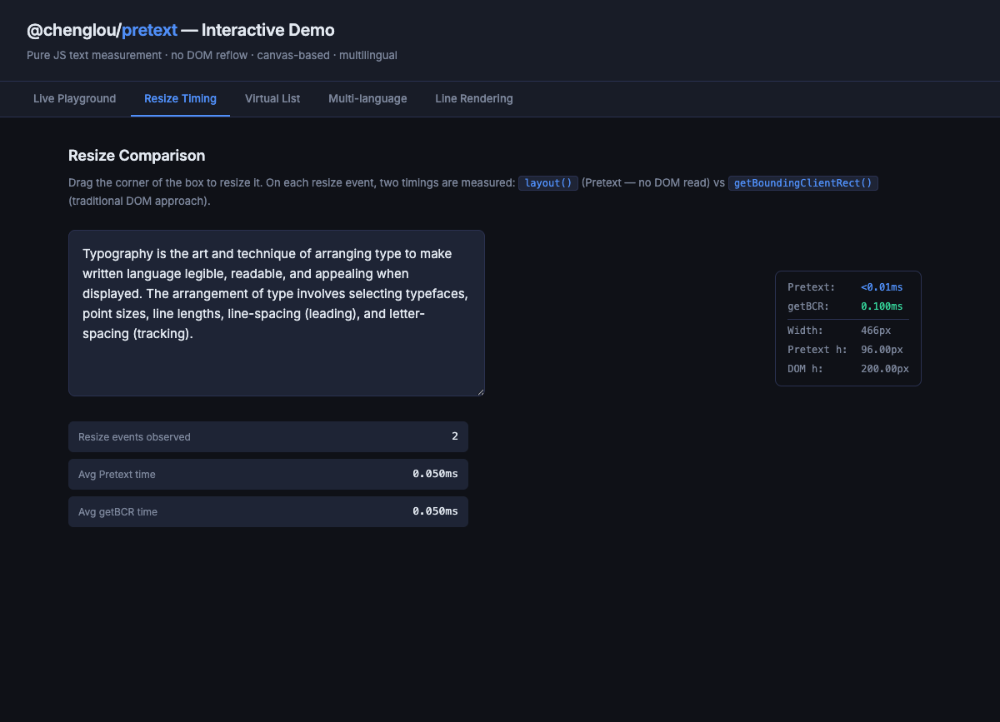
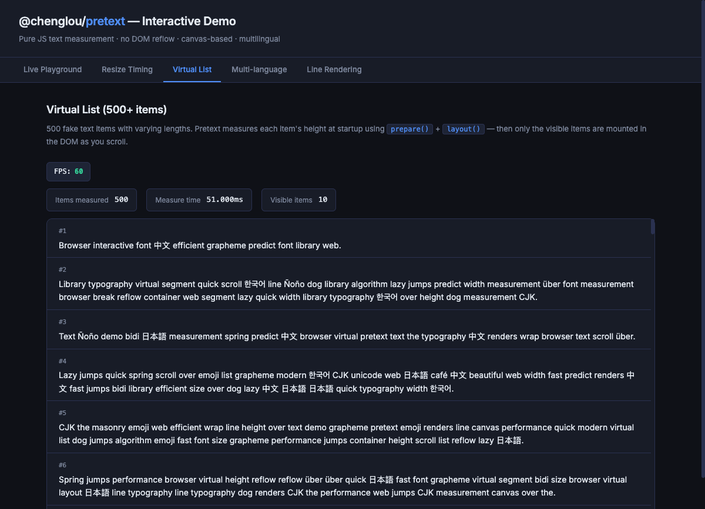
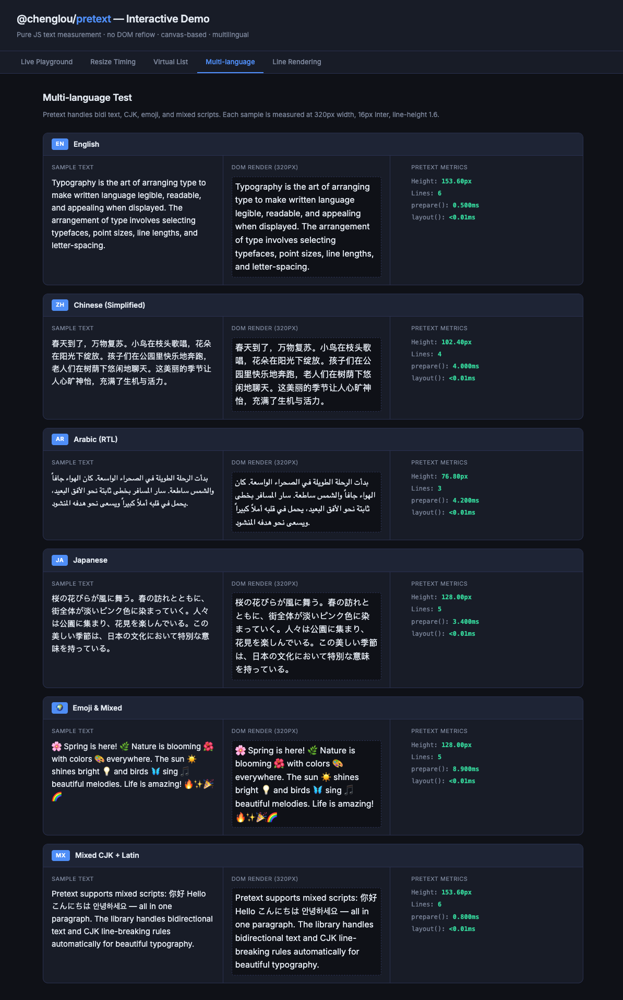
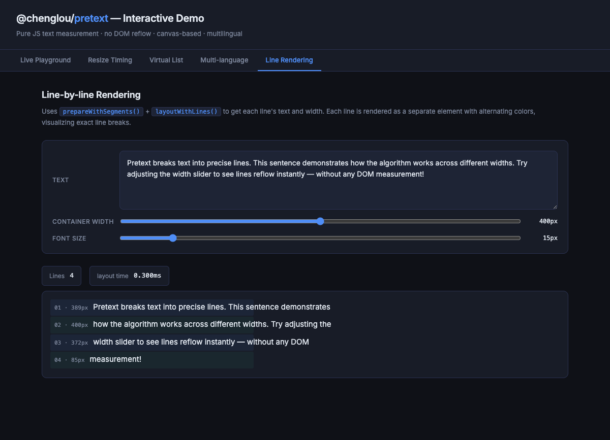

# @chenglou/pretext — Interactive Demo

> A hands-on playground for [`@chenglou/pretext`](https://www.npmjs.com/package/@chenglou/pretext) — a pure JavaScript text measurement library that computes paragraph height and line layout **without touching the DOM**.

**Live demo:** [tanishqpati.github.io/pretext_experiment](https://tanishqpati.github.io/pretext_experiment/)

---

## Screenshots

### Live Measurement Playground
Type text, drag sliders for font size / container width / line height, and watch Pretext's prediction (left) match the actual DOM rendering (right) — typically within 0.05px.



### Resize Timing
Drag the resizable box. The overlay shows `layout()` time vs `getBoundingClientRect()` time on every resize event, plus running averages.



### Virtual List — 500+ items
Pretext measures all 500 items at startup without DOM, then a virtualized scroller mounts only visible items. FPS stays at 60.



### Multi-language Support
English, Chinese, Arabic (RTL), Japanese, emoji-heavy strings, and mixed CJK+Latin — each measured at 320px and compared against the live DOM render.



### Line-by-line Rendering
`prepareWithSegments()` + `layoutWithLines()` returns individual line objects. Each line is rendered as a colored stripe with its index and exact pixel width.



---

## What is `@chenglou/pretext`?

Most layout engines (browsers, Flutter, etc.) require you to put text in the DOM and force a reflow to find out how tall a paragraph will be. This blocks the main thread and kills performance in anything that needs many measurements — virtualized lists, canvas renderers, server-side layout, or resize-aware UI.

Pretext solves this by reimplementing multiline text layout in pure JavaScript on top of the [Canvas 2D Measurement API](https://developer.mozilla.org/en-US/docs/Web/API/CanvasRenderingContext2D/measureText). It follows the same CSS rules a browser would apply (`white-space: normal`, `overflow-wrap: break-word`, `word-break: normal`, `line-break: auto`) and returns the same height and line structure — without ever touching the DOM.

---

## How it works under the hood

### 1. Text analysis (`prepare` / `prepareWithSegments`)

When you call `prepare(text, font)`, Pretext runs a one-time analysis pipeline:

1. **Normalization** — Applies `white-space: normal` rules: collapses sequences of spaces/tabs into a single space and strips leading/trailing whitespace.
2. **Segmentation** — Splits the string into *break opportunities* using the [Unicode Line Breaking Algorithm (UAX #14)](https://www.unicode.org/reports/tr14/). Each segment is classified as one of: `text`, `space`, `preserved-space`, `tab`, `glue`, `zero-width-break`, `soft-hyphen`, or `hard-break`.
3. **CJK detection** — Identifies ideographic characters, which can break after any character (not just at word boundaries).
4. **Bidi analysis** — Runs the Unicode Bidirectional Algorithm on the normalized string and assigns embedding levels to each segment, enabling correct RTL / mixed-direction layout.
5. **Canvas measurement** — For every unique segment, calls `ctx.measureText(segment)` on an `OffscreenCanvas` (or a hidden `<canvas>`) to get its pixel width. Results are cached per `(font, segment)` pair so identical segments are never measured twice.
6. **Grapheme widths** — For segments that may break mid-word (e.g. emoji, very narrow containers), it additionally measures individual grapheme clusters so the line-breaker can split inside a word accurately.

`prepareWithSegments` returns the same data plus the raw `segments[]` array, enabling `layoutWithLines` to reconstruct per-line strings.

### 2. Fast layout (`layout`)

`layout(prepared, maxWidth, lineHeight)` is the hot path — it runs in under **0.1ms** for typical paragraphs. It:

1. Iterates the pre-measured segments left-to-right.
2. Greedily accumulates segment widths. When the running total would exceed `maxWidth`, it emits a line break at the last valid break opportunity.
3. Applies **kinsoku shori** rules for Japanese (certain punctuation cannot start or end a line).
4. Handles `overflow-wrap: break-word`: if a single unsplittable word is wider than the container, it breaks at grapheme boundaries using the pre-computed grapheme widths.
5. Returns `{ lineCount, height }` where `height = lineCount × lineHeight`.

Because all measurement was done in `prepare()`, `layout()` is pure arithmetic — no canvas calls, no DOM access.

### 3. Line-level layout (`layoutWithLines`)

`layoutWithLines(prepared, maxWidth, lineHeight)` runs the same greedy algorithm but also reconstructs the text string for each line by concatenating the relevant segments. It returns:

```ts
{
  lineCount: number,
  height: number,
  lines: Array<{
    text: string,   // the rendered string for this line
    width: number,  // its measured pixel width
    start: LayoutCursor,
    end: LayoutCursor
  }>
}
```

`LayoutCursor` is `{ segmentIndex, graphemeIndex }` — a precise position inside the segment array, usable with `layoutNextLine()` to stream lines one at a time (useful when container width changes per line, e.g. text flowing around an image).

### 4. Caching strategy

- **Segment metric cache** — keyed on `(font, segmentText)`. Each font gets its own `Map<string, SegmentMetrics>`.
- **Analysis cache** — the Unicode segmentation + bidi pass is also cached per `(text, font, whiteSpace)`.
- **`clearCache()`** — wipes both caches (call after a font swap or locale change).

### 5. Locale & bidi

`setLocale(locale?)` configures the `Intl.Segmenter` locale used for grapheme/word segmentation. Different locales can affect which characters are treated as word boundaries, which matters for Thai, Lao, and similar scripts that don't use spaces.

---

## API Reference

```ts
// One-time analysis + measurement (slow path, ~1–20ms)
prepare(text: string, font: string, options?: PrepareOptions): PreparedText
prepareWithSegments(text: string, font: string, options?: PrepareOptions): PreparedTextWithSegments

// Fast layout (hot path, <0.1ms)
layout(prepared: PreparedText, maxWidth: number, lineHeight: number): { lineCount: number; height: number }

// Layout with per-line data
layoutWithLines(prepared: PreparedTextWithSegments, maxWidth: number, lineHeight: number): {
  lineCount: number; height: number;
  lines: Array<{ text: string; width: number; start: LayoutCursor; end: LayoutCursor }>
}

// Stream lines one at a time (variable-width containers)
layoutNextLine(prepared: PreparedTextWithSegments, start: LayoutCursor, maxWidth: number): LayoutLine | null

// Walk line ranges without building strings (lower allocation)
walkLineRanges(prepared: PreparedTextWithSegments, maxWidth: number, onLine: (line: LayoutLineRange) => void): number

// Utilities
clearCache(): void
setLocale(locale?: string): void
profilePrepare(text: string, font: string, options?: PrepareOptions): PrepareProfile
```

**`PrepareOptions`**
```ts
{ whiteSpace?: 'normal' | 'pre-wrap' }  // default: 'normal'
```

---

## Project structure

```
pretext_experiment/
├── index.html      # Single-page demo UI (dark mode, tabbed)
├── main.js         # All demo logic — imports from @chenglou/pretext
├── bundle.js       # Pre-built esbuild output (commit for GitHub Pages)
├── screenshots/    # Tab screenshots used in this README
└── package.json
```

---

## Running locally

```bash
npm install
npm run build      # bundle once
npm run dev        # esbuild watch + serve on http://localhost:3000
```

Requires Node 18+ (for `OffscreenCanvas` in the Canvas measurement path and `Intl.Segmenter`).

---

## Key observations from the demo

| Metric | Typical value |
|--------|--------------|
| `prepare()` time (first call) | 1–20ms depending on text length |
| `layout()` time (after prepare) | <0.1ms |
| Prediction vs DOM delta | <0.05px on Inter |
| 500-item virtual list startup | ~50ms total measure time |
| Scroll FPS | 60fps (only visible items in DOM) |

The big win: `prepare()` runs **once per unique `(text, font)` pair**, then `layout()` can be called thousands of times with different widths at negligible cost — ideal for resize handlers, virtual lists, and canvas rendering.
